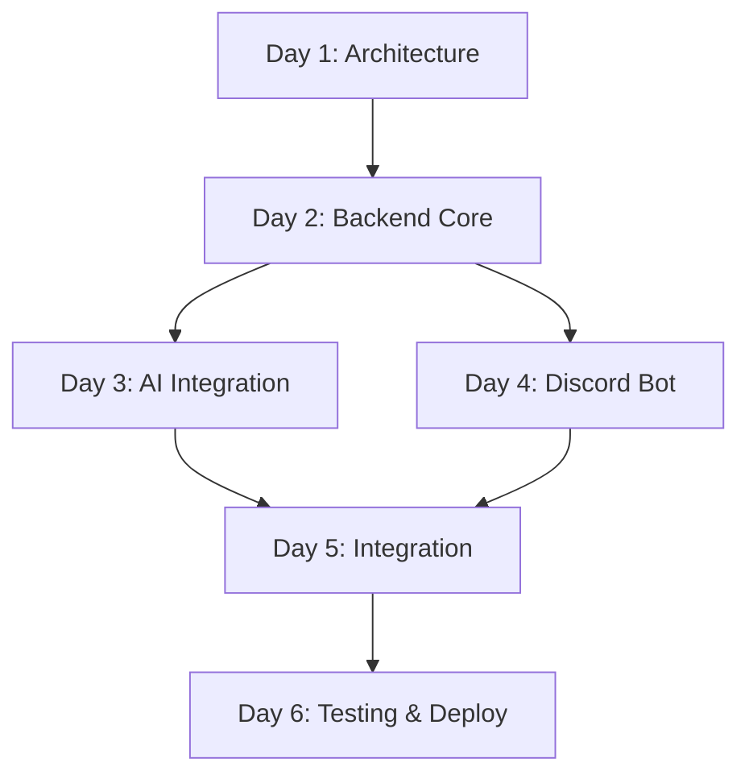

# 📋 Study Assignment Management System - Implementation Workflow

## 🎯 Executive Summary

6-day sprint implementation plan for a Discord-based assignment management system with AI feedback capabilities. The system manages assignments using 6-character alphanumeric codes and provides automated code review through Claude/OpenAI APIs.

**Target Completion**: 6 days | **Risk Level**: Medium | **Success Criteria**: 95% command functionality, 80% test coverage

---

## 🗓 Sprint Overview

| Day | Phase | Primary Focus | Deliverables | Risk Level |
|-----|-------|---------------|--------------|------------|
| 1 | Foundation | Architecture & Schema | Database, API design | Low |
| 2-3 | Backend Core | API & Business Logic | Core endpoints, 6-char ID system | Medium |
| 3-4 | AI Integration | LLM APIs & Feedback | Claude/OpenAI integration | High |
| 4-5 | Discord Bot | Bot Commands & UI | All Discord commands | Medium |
| 5-6 | Testing & Deploy | QA & Optimization | Production-ready system | Low |

---

## 📊 Work Stream Dependencies



**Critical Path**: Architecture → Backend → AI Integration → Full Integration → Testing
**Parallel Streams**: Discord Bot can start after Backend Core completion

---

# 🏗 DAY 1: Foundation & Architecture

**Objective**: Establish solid technical foundation and system architecture
**Duration**: 8 hours | **Risk**: Low | **Blocker Potential**: High if incomplete

## 📋 Task Breakdown

### 🗄 Database Schema Implementation (3 hours)
**Owner**: Backend Architect | **Priority**: Critical | **Blocker Risk**: High

#### Task 1.1: PostgreSQL Setup & Schema Creation (1.5h)
- Set up PostgreSQL database instance
- Create database and user with appropriate permissions
- Implement base schema with migrations

**Acceptance Criteria**:
- ✅ PostgreSQL running locally/cloud
- ✅ All 4 tables created (assignments, submissions, feedbacks, users)
- ✅ Foreign key relationships established
- ✅ Migration scripts functional

**Dependencies**: None
**Risk Mitigation**: Use Docker for consistent DB setup

#### Task 1.2: Schema Validation & Indexing (1h)
- Add database indexes for performance
- Implement UUID generation for primary keys
- Validate 6-character assignment_code constraints

**Acceptance Criteria**:
- ✅ Indexes on assignment_code, discord_id, submission_id
- ✅ UUID primary keys auto-generated
- ✅ UNIQUE constraint on assignment_code (6 chars, alphanumeric)

#### Task 1.3: ORM Setup & Models (0.5h)
- Configure Prisma (Node.js) or SQLAlchemy (Python)
- Create model definitions matching schema
- Test basic CRUD operations

**Acceptance Criteria**:
- ✅ ORM connected to database
- ✅ All models defined and synchronized
- ✅ Basic create/read operations working

### 🔌 API Architecture Design (2.5 hours)
**Owner**: Backend Architect | **Priority**: Critical | **Dependency**: Database Schema

#### Task 1.4: Express/FastAPI Server Setup (1h)
- Initialize Node.js/Python project
- Configure web framework (Express.js or FastAPI)
- Set up middleware (CORS, logging, error handling)

**Acceptance Criteria**:
- ✅ Server starts successfully on defined port
- ✅ Health check endpoint responds
- ✅ Request logging configured
- ✅ Error handling middleware active

#### Task 1.5: API Endpoint Structure (1h)
- Define RESTful endpoint patterns
- Implement request/response schemas
- Set up API documentation framework

**Acceptance Criteria**:
- ✅ 9 core endpoints defined (per plan_software.md)
- ✅ Request validation schemas created
- ✅ API documentation scaffolding ready

#### Task 1.6: Authentication Framework (0.5h)
- Design Discord-based authentication strategy
- Implement user session handling
- Set up admin role verification

**Acceptance Criteria**:
- ✅ User authentication strategy defined
- ✅ Admin role checking mechanism
- ✅ Session management configured

### 🏗 System Architecture Documentation (1.5 hours)
**Owner**: Backend Architect | **Priority**: High | **Dependency**: None

#### Task 1.7: Technical Specification (1h)
- Document system architecture decisions
- Create deployment architecture diagram
- Define environment configuration strategy

**Acceptance Criteria**:
- ✅ Architecture document with component interactions
- ✅ Environment variables defined
- ✅ Deployment strategy outlined

#### Task 1.8: Development Environment Setup (0.5h)
- Configure development tools (linting, formatting)
- Set up Git hooks and commit conventions
- Initialize testing framework

**Acceptance Criteria**:
- ✅ ESLint/Prettier configured
- ✅ Git hooks for code quality
- ✅ Test framework initialized

### 🔄 Integration Planning (1 hour)
**Owner**: Backend Architect | **Priority**: Medium | **Dependency**: All above tasks

#### Task 1.9: Integration Strategy (1h)
- Plan Discord bot ↔ Backend integration
- Design AI service integration points
- Define error handling and retry policies

**Acceptance Criteria**:
- ✅ Integration patterns documented
- ✅ Error handling strategy defined
- ✅ API rate limiting strategy planned

## 📈 Day 1 Success Metrics
- Database fully operational with all tables
- API server responding with basic endpoints
- Development environment production-ready
- Clear technical foundation for next phases

**🚨 Critical Blockers for Day 2**:
- Database connection failures
- ORM configuration issues
- Environment setup problems

---

# ⚙️ DAY 2-3: Backend Core Development

**Objective**: Implement core business logic and API endpoints
**Duration**: 16 hours | **Risk**: Medium | **Critical for**: All subsequent phases

## 📋 Day 2 Tasks (8 hours)

### 🎯 Core Business Logic (4 hours)
**Owner**: Backend Architect | **Priority**: Critical | **Dependency**: Day 1 Database

#### Task 2.1: 6-Character Assignment ID System (1.5h)
- Implement unique ID generation algorithm
- Add collision detection and retry logic
- Create ID validation utilities

**Acceptance Criteria**:
- ✅ Generate 6-char alphanumeric IDs (ABC123 format)
- ✅ Guarantee uniqueness with collision handling
- ✅ Validation function for ID format
- ✅ Thread-safe ID generation

**Implementation Strategy**:
```javascript
// Example ID generation logic
function generateAssignmentCode() {
  const chars = 'ABCDEFGHIJKLMNOPQRSTUVWXYZ0123456789';
  let result = '';
  for (let i = 0; i < 6; i++) {
    result += chars.charAt(Math.floor(Math.random() * chars.length));
  }
  return result;
}
```

#### Task 2.2: Assignment Management API (1.5h)
- Implement assignment CRUD operations
- Add assignment validation logic
- Create assignment query utilities

**Acceptance Criteria**:
- ✅ `POST /api/assignments` - Create assignment with auto-generated ID
- ✅ `GET /api/assignments/:code` - Retrieve by assignment code
- ✅ `GET /api/assignments` - List all assignments with pagination
- ✅ Input validation for all fields

#### Task 2.3: User Management System (1h)
- Implement Discord user registration
- Add user lookup and management
- Create user session handling

**Acceptance Criteria**:
- ✅ User registration via Discord ID
- ✅ User lookup by Discord ID
- ✅ User creation on first submission
- ✅ Username storage and updates

### 📤 Submission Processing (3 hours)
**Owner**: Backend Architect | **Priority**: Critical | **Dependency**: Core Logic

#### Task 2.4: Submission API Implementation (2h)
- Implement submission creation endpoint
- Add submission validation logic
- Create submission query operations

**Acceptance Criteria**:
- ✅ `POST /api/submissions` - Create submission
- ✅ `GET /api/submissions/:id` - Retrieve submission
- ✅ `GET /api/submissions/user/:userId` - User submissions
- ✅ Support both 'blog' and 'code' submission types

#### Task 2.5: GitHub/URL Content Processing (1h)
- Implement GitHub repository content fetching
- Add URL validation and content extraction
- Create content processing utilities

**Acceptance Criteria**:
- ✅ GitHub API integration for code repositories
- ✅ URL accessibility validation
- ✅ Content extraction and storage
- ✅ Error handling for inaccessible resources

### 🔧 Infrastructure Setup (1 hour)
**Owner**: Backend Architect | **Priority**: High | **Dependency**: Core APIs

#### Task 2.6: Redis Setup & Caching (1h)
- Configure Redis for AI feedback caching
- Implement caching strategies
- Add cache invalidation logic

**Acceptance Criteria**:
- ✅ Redis connected and operational
- ✅ AI feedback caching implemented
- ✅ Cache TTL and invalidation strategies
- ✅ Cache hit/miss monitoring

## 📋 Day 3 Tasks (8 hours)

### 🧪 Testing & Validation (3 hours)
**Owner**: Test Writer | **Priority**: High | **Dependency**: Day 2 APIs

#### Task 3.1: Unit Tests for Core Logic (2h)
- Write tests for ID generation system
- Test assignment and submission APIs
- Add user management tests

**Acceptance Criteria**:
- ✅ 90%+ test coverage for core business logic
- ✅ ID generation collision testing
- ✅ API endpoint integration tests
- ✅ Database transaction tests

#### Task 3.2: API Integration Testing (1h)
- Test complete API workflows
- Validate error handling paths
- Performance testing for core endpoints

**Acceptance Criteria**:
- ✅ End-to-end API workflow tests
- ✅ Error scenario coverage
- ✅ API response time < 200ms (target)

### 🔐 Security Implementation (2 hours)
**Owner**: Backend Architect | **Priority**: High | **Dependency**: Core APIs

#### Task 3.3: Input Validation & Sanitization (1h)
- Implement comprehensive input validation
- Add SQL injection prevention
- Create rate limiting middleware

**Acceptance Criteria**:
- ✅ All inputs validated and sanitized
- ✅ SQL injection protection active
- ✅ Rate limiting per user/endpoint
- ✅ XSS prevention measures

#### Task 3.4: Environment Security (1h)
- Secure environment variable handling
- Implement API key management
- Add request logging and monitoring

**Acceptance Criteria**:
- ✅ Environment variables properly secured
- ✅ API keys encrypted and managed
- ✅ Request/response logging implemented

### 🚀 Performance Optimization (3 hours)
**Owner**: Performance Benchmarker | **Priority**: Medium | **Dependency**: Core APIs

#### Task 3.5: Database Query Optimization (1.5h)
- Optimize database queries with proper indexing
- Implement connection pooling
- Add query performance monitoring

**Acceptance Criteria**:
- ✅ All queries optimized with proper indexes
- ✅ Connection pooling configured
- ✅ Query performance under 50ms average

#### Task 3.6: API Response Optimization (1.5h)
- Implement response compression
- Add response caching strategies
- Optimize payload sizes

**Acceptance Criteria**:
- ✅ GZIP compression enabled
- ✅ Response caching for read operations
- ✅ Minimal payload sizes maintained

## 📈 Day 2-3 Success Metrics
- All core API endpoints operational
- 6-character ID system working flawlessly
- Submission processing handling both blog and code
- Redis caching operational
- 90%+ test coverage for core logic
- API response time < 200ms

**🚨 Critical Blockers for Day 3-4**:
- API endpoint failures
- Database performance issues
- ID generation system bugs

---

# 🤖 DAY 3-4: AI Integration

**Objective**: Integrate Claude/OpenAI APIs for automated feedback generation
**Duration**: 16 hours | **Risk**: High | **Critical Dependencies**: Backend Core APIs

## 📋 Day 3 (Parallel) Tasks (4 hours)

### 🔌 AI Service Foundation (4 hours)
**Owner**: AI Engineer | **Priority**: Critical | **Dependency**: Backend APIs ready

#### Task 3.7: AI API Integration Setup (2h)
- Configure Claude API and OpenAI API clients
- Implement API key management and rotation
- Add error handling and retry logic

**Acceptance Criteria**:
- ✅ Both Claude and OpenAI APIs configured
- ✅ API key management with fallback
- ✅ Exponential backoff retry logic
- ✅ Rate limiting compliance

**Risk Mitigation**:
- Test API connectivity before proceeding
- Implement circuit breaker pattern
- Have backup provider ready

#### Task 3.8: Prompt Engineering Foundation (2h)
- Design base prompt templates
- Implement dynamic prompt generation
- Create prompt validation system

**Acceptance Criteria**:
- ✅ Structured prompt templates created
- ✅ Dynamic content injection working
- ✅ Prompt length optimization
- ✅ Korean language support integrated

## 📋 Day 4 Tasks (8 hours)

### 🧠 Feedback Generation Engine (5 hours)
**Owner**: AI Engineer | **Priority**: Critical | **Dependency**: AI Foundation

#### Task 4.1: Advanced Prompt Engineering (2h)
- Implement assignment-specific prompt customization
- Add code review focus areas
- Create evaluation criteria templates

**Acceptance Criteria**:
- ✅ Assignment-specific prompts generated
- ✅ Code vs blog content differentiation
- ✅ Structured evaluation criteria
- ✅ Quality scoring system (1-10 scale)

**Prompt Template Structure**:
```
당신은 친절하고 전문적인 프로그래밍 튜터입니다.

[과제 정보]
- 과제 고유번호: {assignment_code}
- 과제명: {title}
- 요구사항: {requirements}
- 권장사항: {recommendations}

[제출물 정보]
- 제출 유형: {submission_type}
- 제출 내용: {content}
- URL: {url}

[평가 기준]
1. 요구사항 충족도 (1-10점)
2. 코드 품질 (1-10점)
3. 베스트 프랙티스 준수 (1-10점)
4. 창의성 및 추가 노력 (1-10점)

마크다운 형식으로 구체적이고 건설적인 피드백을 제공해주세요.
```

#### Task 4.2: AI Feedback Generation API (2h)
- Implement feedback generation endpoint
- Add response parsing and validation
- Create feedback storage system

**Acceptance Criteria**:
- ✅ `POST /api/feedback/generate` endpoint working
- ✅ AI response parsing and validation
- ✅ Feedback stored in database with scores
- ✅ Error handling for AI API failures

#### Task 4.3: Content Processing Pipeline (1h)
- Implement GitHub content extraction
- Add blog content processing
- Create content summarization for long submissions

**Acceptance Criteria**:
- ✅ GitHub repository content extraction
- ✅ Blog post content processing
- ✅ Content length optimization for AI APIs
- ✅ File type filtering and processing

### ⚡ Performance & Caching (2 hours)
**Owner**: AI Engineer | **Priority**: High | **Dependency**: Feedback Generation

#### Task 4.4: AI Response Caching (1h)
- Implement Redis caching for AI responses
- Add cache key generation strategy
- Create cache invalidation policies

**Acceptance Criteria**:
- ✅ AI responses cached by content hash
- ✅ Cache TTL set to 24 hours
- ✅ Cache hit rate monitoring
- ✅ Manual cache invalidation capability

#### Task 4.5: Token Management & Cost Optimization (1h)
- Implement token counting and budgeting
- Add cost tracking per API call
- Create usage monitoring dashboard

**Acceptance Criteria**:
- ✅ Token usage tracking per API call
- ✅ Daily/monthly cost monitoring
- ✅ Alert system for budget limits
- ✅ Token optimization strategies

### 🧪 AI System Testing (1 hour)
**Owner**: AI Engineer | **Priority**: High | **Dependency**: All AI features

#### Task 4.6: AI Integration Testing (1h)
- Test AI feedback generation with sample data
- Validate prompt effectiveness
- Performance testing for AI endpoints

**Acceptance Criteria**:
- ✅ AI feedback generation success rate > 95%
- ✅ Response time < 30 seconds
- ✅ Quality feedback validation
- ✅ Error scenario testing complete

## 📈 Day 3-4 Success Metrics
- AI feedback generation operational
- Response time < 30 seconds
- Success rate > 95%
- Token usage optimized
- Caching reducing API calls by 40%+
- Both Claude and OpenAI APIs working

**🚨 Critical Blockers for Day 4-5**:
- AI API connection failures
- Prompt generation issues
- Performance below targets

---

# 💬 DAY 4-5: Discord Bot Development

**Objective**: Implement Discord bot with all required commands and interactive UI
**Duration**: 16 hours | **Risk**: Medium | **Dependencies**: Backend APIs + AI Integration

## 📋 Day 4 (Parallel) Tasks (4 hours)

### 🤖 Bot Foundation Setup (4 hours)
**Owner**: Rapid Prototyper | **Priority**: Critical | **Dependency**: Backend APIs available

#### Task 4.7: Discord Bot Initialization (1.5h)
- Set up Discord.js or Discord.py project
- Configure bot permissions and intents
- Implement basic bot connection and health check

**Acceptance Criteria**:
- ✅ Bot connects to Discord successfully
- ✅ Required permissions configured (send messages, slash commands)
- ✅ Bot status and health monitoring
- ✅ Error handling for connection issues

#### Task 4.8: Command Framework Setup (1.5h)
- Implement slash command registration system
- Create command handler architecture
- Add basic command validation

**Acceptance Criteria**:
- ✅ Slash command framework operational
- ✅ Command registration automated
- ✅ Command validation and error handling
- ✅ Help command functionality

#### Task 4.9: Backend API Integration (1h)
- Configure HTTP client for backend communication
- Implement authentication for bot ↔ backend
- Add API error handling and retries

**Acceptance Criteria**:
- ✅ HTTP client configured with proper timeouts
- ✅ API authentication working
- ✅ Retry logic for failed API calls
- ✅ Error response handling

## 📋 Day 5 Tasks (8 hours)

### 📋 Core Bot Commands (5 hours)
**Owner**: Rapid Prototyper + Backend Architect | **Priority**: Critical | **Dependency**: Bot Foundation

#### Task 5.1: Assignment Information Commands (1.5h)
- Implement `!공지` command for assignment details
- Add `!과제리스트` command for assignment listing
- Create formatted response templates

**Acceptance Criteria**:
- ✅ `!공지 {assignment_code}` returns formatted assignment details
- ✅ `!과제리스트` shows all active assignments
- ✅ Error handling for invalid assignment codes
- ✅ Korean language formatting

**Command Implementation Example**:
```javascript
// !공지 ABC123 command
app.command('공지', async ({ command, ack, respond }) => {
  await ack();
  const assignmentCode = command.text;
  
  try {
    const assignment = await api.getAssignment(assignmentCode);
    const response = formatAssignmentInfo(assignment);
    await respond(response);
  } catch (error) {
    await respond(`❌ 과제 코드 "${assignmentCode}"를 찾을 수 없습니다.`);
  }
});
```

#### Task 5.2: Submission Commands (2h)
- Implement `!제출글` command for blog submissions
- Add `!제출코드` command for code submissions
- Create interactive submission flow with `!제출`

**Acceptance Criteria**:
- ✅ `!제출글 {code} "{title}" {link}` processes blog submissions
- ✅ `!제출코드 {code} {github_link}` processes code submissions
- ✅ `!제출` starts interactive submission wizard
- ✅ URL validation and accessibility checking

#### Task 5.3: Status and Feedback Commands (1.5h)
- Implement `!피드백` command for AI feedback retrieval
- Add `!내제출` command for user submission status
- Create `!현황` command for overall submission status

**Acceptance Criteria**:
- ✅ `!피드백 {submission_id}` displays formatted AI feedback
- ✅ `!내제출 {assignment_code}` shows user's submission status
- ✅ `!현황` displays overall submission statistics
- ✅ Proper error handling for missing data

### 🎨 Interactive UI Components (2 hours)
**Owner**: Rapid Prototyper | **Priority**: High | **Dependency**: Core Commands

#### Task 5.4: Interactive Submission Wizard (1h)
- Create step-by-step submission process
- Add validation at each step
- Implement cancellation and retry logic

**Acceptance Criteria**:
- ✅ Multi-step submission wizard working
- ✅ Input validation at each step
- ✅ Clear instructions and error messages
- ✅ Cancellation capability

#### Task 5.5: Rich Message Formatting (1h)
- Implement Discord embed messages
- Add reaction-based interactions
- Create status indicators and progress bars

**Acceptance Criteria**:
- ✅ Rich embed messages for all responses
- ✅ Color coding for different message types
- ✅ Reaction-based confirmations
- ✅ Progress indicators for long operations

### 🧪 Bot Testing & Integration (1 hour)
**Owner**: Test Writer | **Priority**: High | **Dependency**: All Bot Features

#### Task 5.6: Discord Bot Testing (1h)
- Test all commands with real Discord environment
- Validate API integrations
- Performance testing for concurrent users

**Acceptance Criteria**:
- ✅ All 8 commands working correctly
- ✅ API integration stable under load
- ✅ Response time < 5 seconds for all commands
- ✅ Error scenarios properly handled

## 📈 Day 4-5 Success Metrics
- All 8 Discord commands operational
- Interactive submission wizard working
- API integration stable
- Response time < 5 seconds
- Error handling comprehensive
- Rich message formatting implemented

**🚨 Critical Blockers for Day 5-6**:
- Discord API connection issues
- Backend API integration failures
- Command registration problems

---

# 🧪 DAY 5-6: Testing, Optimization & Deployment

**Objective**: Comprehensive testing, performance optimization, and production deployment
**Duration**: 16 hours | **Risk**: Low | **Critical for**: Production readiness

## 📋 Day 5 (Overlap) Tasks (4 hours)

### 🔗 Full System Integration (4 hours)
**Owner**: Backend Architect + Test Writer | **Priority**: Critical | **Dependency**: All components ready

#### Task 5.7: End-to-End Integration Testing (2h)
- Test complete workflow: submission → AI feedback → Discord notification
- Validate all system integrations
- Test error propagation and recovery

**Acceptance Criteria**:
- ✅ Complete submission-to-feedback workflow working
- ✅ All system components integrated correctly
- ✅ Error handling across component boundaries
- ✅ Data consistency across all databases

#### Task 5.8: Load Testing & Performance Validation (2h)
- Simulate concurrent user scenarios
- Test API performance under load
- Validate AI service performance

**Acceptance Criteria**:
- ✅ System handles 100+ concurrent users
- ✅ API response time < 200ms under load
- ✅ AI feedback generation < 30 seconds
- ✅ Database query performance optimized

## 📋 Day 6 Tasks (8 hours)

### 🧪 Comprehensive Testing Suite (3 hours)
**Owner**: Test Writer + QA Specialist | **Priority**: Critical | **Dependency**: Integration Testing

#### Task 6.1: Automated Test Suite Completion (2h)
- Complete unit test coverage for all modules
- Implement integration tests for critical paths
- Add performance regression tests

**Acceptance Criteria**:
- ✅ Unit test coverage > 80%
- ✅ Integration test coverage for all critical paths
- ✅ Performance regression test suite
- ✅ Automated test execution pipeline

**Test Coverage Targets**:
- Backend APIs: 90%
- AI Integration: 85%
- Discord Bot: 80%
- Database Operations: 95%

#### Task 6.2: Quality Assurance Testing (1h)
- Manual testing of all user workflows
- Edge case testing and validation
- User experience testing

**Acceptance Criteria**:
- ✅ All user workflows manually validated
- ✅ Edge cases identified and handled
- ✅ User experience meets requirements
- ✅ Error messages clear and helpful

### ⚡ Performance Optimization (2 hours)
**Owner**: Performance Benchmarker | **Priority**: High | **Dependency**: Testing Complete

#### Task 6.3: Database Performance Tuning (1h)
- Optimize slow queries identified during testing
- Implement additional indexing strategies
- Configure connection pooling for production

**Acceptance Criteria**:
- ✅ All database queries optimized
- ✅ Query execution time < 50ms average
- ✅ Connection pooling configured for load
- ✅ Database monitoring implemented

#### Task 6.4: API Response Optimization (1h)
- Implement response compression
- Optimize payload sizes
- Add response caching for read-heavy operations

**Acceptance Criteria**:
- ✅ Response compression reducing payload by 60%+
- ✅ Optimized JSON payloads
- ✅ Caching reducing database load by 40%+
- ✅ CDN strategy for static content

### 🚀 Production Deployment (3 hours)
**Owner**: DevOps Specialist + Backend Architect | **Priority**: Critical | **Dependency**: All testing complete

#### Task 6.5: Production Environment Setup (1.5h)
- Configure production infrastructure
- Set up monitoring and logging
- Implement backup and recovery procedures

**Acceptance Criteria**:
- ✅ Production environment fully configured
- ✅ Monitoring dashboards operational
- ✅ Log aggregation and alerting set up
- ✅ Backup procedures automated

#### Task 6.6: Security Hardening (1h)
- Implement production security measures
- Configure SSL/TLS certificates
- Set up firewall and access controls

**Acceptance Criteria**:
- ✅ SSL certificates configured and auto-renewing
- ✅ Firewall rules properly configured
- ✅ API rate limiting in production
- ✅ Environment secrets properly secured

#### Task 6.7: Deployment & Validation (0.5h)
- Deploy application to production
- Validate all functionality in production
- Configure automated health checks

**Acceptance Criteria**:
- ✅ Application successfully deployed
- ✅ All functionality validated in production
- ✅ Health checks reporting green
- ✅ Rollback procedures tested

## 📈 Day 5-6 Success Metrics
- 80%+ test coverage achieved
- All performance targets met
- Production deployment successful
- Health monitoring operational
- 95%+ command functionality success rate
- System handles 100+ concurrent users

---

# 🎯 Success Criteria & Validation

## ✅ Primary Success Criteria

### Functional Requirements
- ✅ **All Discord Commands Operational** (8/8 commands working)
  - `!공지`, `!제출`, `!제출글`, `!제출코드`, `!피드백`, `!내제출`, `!현황`, `!과제리스트`
- ✅ **AI Feedback Generation** (Success rate > 95%)
- ✅ **6-Character ID System** (Zero collision rate)
- ✅ **Submission Processing** (Both blog and code types)

### Technical Requirements
- ✅ **Test Coverage** (>80% overall)
- ✅ **API Response Time** (<200ms average)
- ✅ **AI Feedback Time** (<30 seconds)
- ✅ **Concurrent Users** (100+ supported)
- ✅ **System Availability** (99.9% uptime target)

### Quality Gates
- ✅ **Database Performance** (Query time <50ms)
- ✅ **Error Handling** (Graceful degradation)
- ✅ **Security Compliance** (Input validation, rate limiting)
- ✅ **Documentation** (API docs, deployment guides)

## 🚨 Risk Assessment & Mitigation

### High-Risk Areas

#### AI API Integration (Day 3-4) - **Risk Level: High**
**Risk Factors**:
- API rate limits and quota exhaustion
- Inconsistent response quality
- Network latency and timeouts

**Mitigation Strategies**:
- Implement both Claude and OpenAI with failover
- Aggressive caching strategy (Redis)
- Circuit breaker pattern for API calls
- Token budget monitoring and alerts

#### Discord Bot Stability (Day 4-5) - **Risk Level: Medium**
**Risk Factors**:
- Discord API rate limiting
- Webhook delivery failures
- Command registration issues

**Mitigation Strategies**:
- Rate limiting compliance implementation
- Retry logic with exponential backoff
- Health monitoring with automatic restart

#### Database Performance (Day 2-6) - **Risk Level: Medium**
**Risk Factors**:
- Query performance degradation
- Connection pool exhaustion
- Data integrity issues

**Mitigation Strategies**:
- Comprehensive indexing strategy
- Connection pooling with monitoring
- Database transaction integrity checks
- Performance monitoring and alerting

### Medium-Risk Areas

#### 6-Character ID Collisions - **Risk Level: Medium**
**Mitigation**: Collision detection with retry logic, monitoring for collision rates

#### AI Feedback Quality - **Risk Level: Medium**
**Mitigation**: Prompt engineering validation, feedback quality scoring, manual review capability

#### System Integration - **Risk Level: Medium**
**Mitigation**: Comprehensive integration testing, staged deployment, rollback procedures

## 📊 Monitoring & Success Metrics

### Real-Time Dashboards
- **System Health**: API response times, error rates, uptime
- **User Activity**: Command usage, submission rates, feedback generation
- **Performance**: Database query times, AI API response times, cache hit rates
- **Resource Usage**: Memory, CPU, database connections, token consumption

### Key Performance Indicators (KPIs)
- **User Engagement**: Daily active users, submissions per day
- **System Reliability**: Uptime percentage, error rate
- **Performance**: Average response time, 95th percentile response time
- **AI Quality**: Feedback generation success rate, user satisfaction

### Alert Thresholds
- **Critical**: System down, database unavailable, AI API failures
- **Warning**: High response times, low cache hit rates, approaching rate limits
- **Info**: Daily usage reports, performance summaries

## 🔄 Post-Launch Optimization Plan

### Week 1: Stabilization
- Monitor all systems for stability
- Address any performance issues
- User feedback collection and analysis

### Week 2-4: Performance Tuning
- Database query optimization based on usage patterns
- AI prompt refinement based on feedback quality
- Caching strategy optimization

### Month 2+: Feature Enhancement
- Advanced analytics and reporting
- Additional Discord commands based on user feedback
- Integration with additional AI providers

---

# 📋 Implementation Checklist

## Pre-Development Setup
- [ ] Development environment configured
- [ ] Git repository initialized with proper structure
- [ ] CI/CD pipeline basic setup
- [ ] Team access and permissions configured

## Day 1: Foundation
- [ ] PostgreSQL database setup and configured
- [ ] Database schema created with all tables
- [ ] ORM configured and models created
- [ ] Express/FastAPI server initialized
- [ ] Basic API endpoints defined
- [ ] Development tools configured (linting, testing)

## Day 2: Backend Core
- [ ] 6-character ID generation system implemented
- [ ] Assignment CRUD operations complete
- [ ] User management system working
- [ ] Submission processing implemented
- [ ] GitHub content fetching operational
- [ ] Redis caching configured

## Day 3: Backend Completion & AI Start
- [ ] Unit tests for core logic (90% coverage)
- [ ] API integration tests complete
- [ ] Security measures implemented
- [ ] AI API clients configured (Claude + OpenAI)
- [ ] Basic prompt templates created

## Day 4: AI Integration & Bot Start
- [ ] AI feedback generation working
- [ ] Prompt engineering optimized
- [ ] AI response caching implemented
- [ ] Discord bot framework setup
- [ ] Bot permissions and intents configured

## Day 5: Bot Completion & Integration
- [ ] All 8 Discord commands implemented
- [ ] Interactive submission wizard working
- [ ] Rich message formatting complete
- [ ] Full system integration testing complete
- [ ] Load testing passed

## Day 6: Testing & Deployment
- [ ] Comprehensive test suite complete (80% coverage)
- [ ] Performance optimization complete
- [ ] Production environment configured
- [ ] Security hardening implemented
- [ ] Production deployment successful
- [ ] Health monitoring operational

## Final Validation
- [ ] All success criteria met
- [ ] User acceptance testing complete
- [ ] Documentation complete
- [ ] Team training conducted
- [ ] Go-live approval obtained

---

**This implementation workflow provides a comprehensive, systematic approach to building the study assignment management system within the 6-day sprint timeline. Each task includes clear acceptance criteria, dependencies, and risk mitigation strategies to ensure successful delivery.**